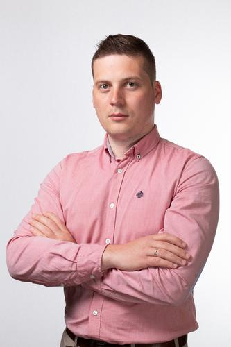

#Форш Алексей Владимирович#
Мужчина, 34 года, родился 20 февраля 1988

##Обо мне:##
Получаю дополнительное профессиональное образование в ООО "НЕТОЛОГИЯ" по направлению "JAVA-разработчик" . Дополнительно прохожу обучение в приложении JAVARUSH.  
 

##Навыки:##
1. Знание Java Core, ООП, SOLID, Collections Framework, Многопоточность.
1. Разработка с использованием IDE Intelij IDEA.  
1. Использование системы контроля версий Git.

##Репозиторий с выполненными заданиями:##
https://github.com/....

##Ключевые проекты по результам курса:##

